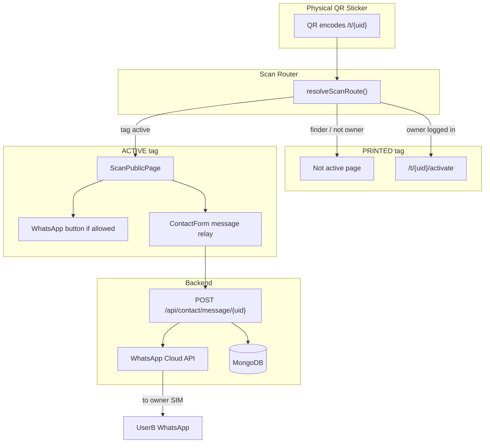

# Qtag System Guide

Complete documentation for the **current Qtag-web implementation**: QR scan flow, owner activation, public contact page, privacy relay messaging, and owner-controlled WhatsApp contact.

Stack: **Next.js 16 (App Router)**, **TypeScript**, **MongoDB/Mongoose**, **JWT auth**, **WhatsApp Cloud API**, **Tailwind CSS**.

---

## Table of contents

1. [What this app does](#1-what-this-app-does)
2. [High-level architecture](#2-high-level-architecture)
3. [User roles](#3-user-roles)
4. [QR sticker flow (production)](#4-qr-sticker-flow-production)
5. [Tag lifecycle](#5-tag-lifecycle)
6. [Authentication (OTP)](#6-authentication-otp)
7. [Tag activation (owner)](#7-tag-activation-owner)
8. [Public scan page (finder)](#8-public-scan-page-finder)
9. [Privacy contact: `isPhoneNumberAllow`](#9-privacy-contact-isphonenumberallow)
10. [WhatsApp relay vs direct WhatsApp](#10-whatsapp-relay-vs-direct-whatsapp)
11. [Scan beacon & message storage](#11-scan-beacon--message-storage)
12. [Shopify embed mode](#12-shopify-embed-mode)
13. [Development testing](#13-development-testing)
14. [Database models](#14-database-models)
15. [API reference](#15-api-reference)
16. [Frontend file map](#16-frontend-file-map)
17. [Environment variables](#17-environment-variables)
18. [Security & privacy rules](#18-security--privacy-rules)
19. [Testing checklist](#19-testing-checklist)
20. [Known limits (Pakistan / mobile)](#20-known-limits-pakistan--mobile)
21. [Legacy: WebRTC browser calls](#21-legacy-webrtc-browser-calls)

---

## 1. What this app does

Qtag is a **smart QR tag platform** for Pakistan. A physical sticker has a unique code (`uid`). When someone scans it:

| Scenario | What happens |
|----------|--------------|
| Tag not activated yet (`PRINTED`) | Finder sees “not active”. Owner can log in and activate. |
| Tag active (`ACTIVE`, `LOST`, `FOUND`) | Finder sees a **public contact page** — no login required. |
| Owner allows phone (`isPhoneNumberAllow = true`) | Finder can open **WhatsApp** to the owner directly. |
| Owner hides phone (`isPhoneNumberAllow = false`) | Finder only uses **in-app message**. Qtag relays it to owner’s WhatsApp **from the company business number**. |

**Privacy goal:** UserA (finder) and UserB (owner) do not expose SIM numbers on the public page unless the owner explicitly opts in to WhatsApp contact.

---

## 2. High-level architecture



---

## 3. User roles

### UserB — Tag owner
- Buys / receives a printed sticker with unique `uid`.
- Logs in with Pakistan mobile OTP.
- Activates the tag once (binds tag to their account).
- Sets **`isPhoneNumberAllow`** during activation (WhatsApp opt-in).
- Receives scan alerts and finder messages on their WhatsApp.

### UserA — Finder (public)
- Scans QR with any phone browser.
- **No account required** on the public contact page.
- Can message owner through Qtag relay, or open WhatsApp if owner allowed it.

---

## 4. QR sticker flow (production)

### URL on the sticker

Always encode the **router URL**, not `/activate`:

```
https://YOUR_QTAG_HOST/t/{uid}
```

Example: `https://qtag.pk/t/devar7kp`

Alternate entry (same logic): `/scan/{uid}`

### Router decision tree

File: `src/lib/scan-router.ts`  
Pages: `src/app/t/[uid]/page.tsx`, `src/app/scan/[slug]/page.tsx`

```
Open /t/{uid}
    │
    ├─ Invalid uid ──────────────► 404
    │
    ├─ Tag PRINTED (no owner)
    │     ├─ Logged-in eligible owner ─► redirect /t/{uid}/activate
    │     └─ Everyone else ────────────► “Tag not active yet” page
    │
    └─ Tag ACTIVE / LOST / FOUND ──────► Public contact page (ScanPublicPage)
```

**Eligible owner** means:
- Dev test tag → any logged-in user
- `ORDER` origin → user who owns the order
- `DASHBOARD` origin → user who created the tag

---

## 5. Tag lifecycle

| Status | Meaning |
|--------|---------|
| `PRINTED` | Sticker created, not activated |
| `ACTIVE` | Owner activated, public profile live |
| `LOST` | Owner marked lost — shows reward/banner on scan page |
| `FOUND` | Item found state |
| `DISABLED` | Tag deactivated |

Model: `src/models/Tag.ts`

Key fields: `uid`, `status`, `ownerId`, `productType`, `publicName`, `vehicle`, `origin`, `orderId`.

---

## 6. Authentication (OTP)

### Flow

1. User opens `/login?next=/t/{uid}/activate` (or `/dev/qr` in dev).
2. Enters Pakistan mobile (`0300…`).
3. `POST /api/auth/otp/start` sends OTP via WhatsApp (or logs to terminal in dev).
4. User verifies at `/verify`.
5. `POST /api/auth/otp/verify` sets JWT cookie `qrs_session`.
6. Redirect to `next` param or `/dev/qr` (embed dev mode).

### Dev fast OTP

When `NODE_ENV=development` or `NEXT_PUBLIC_DEV_FAST_OTP=true`:
- OTP auto-starts from URL `?phone=`
- Dev code shown in URL and API response
- Uses `window.location.assign` for reliable mobile redirect

Files: `src/app/login/page.tsx`, `src/app/verify/page.tsx`, `src/lib/otp.ts`, `src/lib/dev-auth.ts`

### Middleware auth gate

File: `src/middleware.ts`

- **Requires login:** `/t/{uid}/activate` only
- **Public (no login):** `/t/{uid}`, `/scan/{uid}`, contact APIs, message form

---

## 7. Tag activation (owner)

### Page

`/t/{uid}/activate` → `src/app/t/[uid]/activate/page.tsx`  
Form: `src/components/activate/ActivateTagForm.tsx`  
API: `POST /api/activate/{uid}`

### Owner fills in

- **CAR:** plate, make, model, color, year, display name
- **Other types:** title, description, display name
- **Allow WhatsApp contact** checkbox → saves `isPhoneNumberAllow` on User

### On success

- Tag `status` → `ACTIVE`
- Tag `ownerId` → current user
- User `isPhoneNumberAllow` → checkbox value (default `false`)

---

## 8. Public scan page (finder)

File: `src/components/scan/ScanPublicPage.tsx`

### What finder sees (ACTIVE tag)

- Item/category details (car plate, pet title, etc.)
- Owner display name
- **Masked phone** (e.g. `+92 3** *** **96`) — never the real SIM on page
- **Reach the owner** actions (see next section)
- **Message form** (`ContactForm`)
- Scan beacon (logs visit, optional owner ping)

Sub-components:
- `ScanActionsBar` — WhatsApp + Message buttons
- `ContactForm` — in-app message relay
- `ScanBeacon` — `POST /api/scans`

Data loaded via `getPublicProfile()` in `src/lib/services/qr-product.service.ts`.

---

## 9. Privacy contact: `isPhoneNumberAllow`

### Database field

Model: `src/models/User.ts`

```typescript
isPhoneNumberAllow: boolean  // default: false
```

Set during activation from checkbox in `ActivateTagForm`.

### Behavior matrix

| `isPhoneNumberAllow` | Scan page buttons | Finder sees owner number? | Message delivery |
|---------------------|-------------------|---------------------------|------------------|
| `true` | **WhatsApp owner** + Message | No on page; WhatsApp opens owner chat | `notifyOwner()` — standard alert |
| `false` | **Message only** | No — masked number only | `notifyOwnerRelay()` — from company line |

### Public profile projection

`getPublicProfile()` returns:

```typescript
{
  isPhoneNumberAllow: boolean,
  whatsappHref: string | null,  // wa.me link only when allowed
  ownerPhoneMasked: string,     // always masked on page
}
```

WhatsApp link builder (server-side only):

```typescript
https://wa.me/{ownerDigits}?text=Hello, I scanned your Qtag tag.
```

---

## 10. WhatsApp relay vs direct WhatsApp

### When owner allows phone (`true`)

**Scan page:** Yellow **WhatsApp owner** button opens `wa.me` link.

**In-app message:** Still works. Uses `notifyOwner()` in `src/lib/whatsapp.ts`. Finder’s optional phone can be appended for owner callback.

### When owner hides phone (`false`) — your relay requirement

**Scan page:** No WhatsApp button. Only **Message the owner**.

**When UserA sends message:**

1. `POST /api/contact/message/{uid}`
2. Backend loads tag + owner
3. Calls `notifyOwnerRelay()` — file `src/lib/whatsapp.ts`
4. Message sent **from Qtag WhatsApp Business number** (configured in Meta) **to UserB’s WhatsApp**
5. UserA’s SIM is **not** used to send — only Qtag’s business API sends

**Example relay body (conceptual):**

```
🔔 Qtag (03261548853)

Someone scanned your Car tag and sent this message through our relay:

"Hi, I found your car near ..."

Finder contact (shared with you): +92325555555

Time: 26/05/2026, 7:30 pm
```

**Company display number:** `NEXT_PUBLIC_COMPANY_CONTACT_PHONE` (e.g. `03261548853`) — shown in UI copy and relay message text. Actual sending uses `WHATSAPP_PHONE_NUMBER_ID` + `WHATSAPP_ACCESS_TOKEN` from Meta.

### Dev mode (no WhatsApp credentials)

If WhatsApp env vars are empty, messages print to **server terminal**:

```
📱 [WhatsApp:dev] → +923084548855
    🔒 Qtag (03261548853) ...
```

---

## 11. Scan beacon & message storage

### Scan beacon

`ScanBeacon` component → `POST /api/scans`

- Logs scan in `Scan` collection
- Optionally notifies owner: “Someone scanned your QR at {time}”

### Message storage

`POST /api/contact/message/{uid}` also creates:

- `Scan` record (with optional geo)
- `Message` record in `Message` collection
- Finder phone stored as **bcrypt hash** (not plaintext in DB)

Models: `src/models/Scan.ts`, `src/models/Message.ts`

---

## 12. Shopify embed mode

File: `src/lib/shopify-embed.ts`  
Flag: `SHOPIFY_EMBED_MODE = true`

### Active in embed mode

| Route | Purpose |
|-------|---------|
| `/login`, `/verify` | OTP auth |
| `/t/{uid}`, `/scan/{uid}` | Public scan router |
| `/t/{uid}/activate` | Owner activation |
| `/dev/qr` | Dev QR lab (development only) |
| `/api/auth/*` | Auth APIs |
| `/api/activate/{uid}` | Activation |
| `/api/contact/message/{uid}` | Message relay |
| `/api/scans` | Scan beacon |

### Disabled in embed mode (503 / redirect)

- Shop, checkout, dashboard UI
- Orders UI, payments
- Tag management APIs (`/api/tags`, `/api/orders`, …)

Middleware blocks non-allowed paths → redirects to `/login`.

See also: `SHOPIFY_EMBED.md` (short reference).

---

## 13. Development testing

### Start server

```bash
cd qtag-website
npm run dev
```

Listens on `0.0.0.0:3000` (accessible from phone on same Wi‑Fi).

### LAN IP in env

`.env.local`:

```env
NEXT_PUBLIC_APP_URL=http://192.168.x.x:3000
NEXT_PUBLIC_QR_BASE_URL=http://192.168.x.x:3000
NEXT_PUBLIC_DEV_FAST_OTP=true
OTP_TEST_EXPOSE_CODE=true
NEXT_PUBLIC_COMPANY_CONTACT_PHONE=03261548853
```

**Important:** Add your LAN IP to `allowedDevOrigins` in `next.config.mjs` or Next.js blocks phone assets.

Restart dev server after env or config changes.

### Dev QR lab

URL: `/dev/qr` (requires login, development only)

Seeds test tags:

| UID | Category |
|-----|----------|
| `devar7kp` | Car |
| `devpet7k` | Pet |
| `devbag7k` | Bag |
| `devhme7k` | Home |
| `devbyb7k` | Baby |

QRs encode `/t/{uid}` (production-style router URL).

File: `src/app/dev/qr/page.tsx`, `src/lib/dev-test-tags.ts`

### Test flow (two phones)

1. **Phone A (owner):** Login → `/dev/qr` → activate `devar7kp`
   - Check or uncheck **Allow WhatsApp contact**
2. **Phone B (finder):** Open `http://LAN_IP:3000/t/devar7kp`
3. Test message relay → check terminal for WhatsApp dev stub
4. If `isPhoneNumberAllow=true` → **WhatsApp owner** button appears

### Toggle `isPhoneNumberAllow` on existing user (MongoDB)

```javascript
db.users.updateOne(
  { phone: "+923084548855" },
  { $set: { isPhoneNumberAllow: true } }
)
```

---

## 14. Database models

| Model | File | Purpose |
|-------|------|---------|
| `User` | `src/models/User.ts` | Owner account, phone, **`isPhoneNumberAllow`** |
| `Tag` | `src/models/Tag.ts` | Sticker uid, status, owner, vehicle/details |
| `Scan` | `src/models/Scan.ts` | Scan events |
| `Message` | `src/models/Message.ts` | Finder → owner messages |
| `OtpSession` | `src/models/OtpSession.ts` | OTP verification |
| `Order` | `src/models/Order.ts` | Shop orders (disabled in embed) |
| `CallSession` | `src/models/CallSession.ts` | WebRTC sessions (legacy, not on scan UI) |

---

## 15. API reference

### Auth

| Method | Path | Description |
|--------|------|-------------|
| POST | `/api/auth/otp/start` | Send OTP |
| POST | `/api/auth/otp/verify` | Verify OTP, set session |
| GET | `/api/auth/me` | Current user |
| POST | `/api/auth/logout` | Clear session |

### Tags & activation

| Method | Path | Description |
|--------|------|-------------|
| POST | `/api/activate/{uid}` | Activate tag + save `isPhoneNumberAllow` |

### Public contact

| Method | Path | Description |
|--------|------|-------------|
| POST | `/api/contact/message/{uid}` | Finder message → owner WhatsApp relay |
| POST | `/api/scans` | Scan beacon |

### Dev only

| Method | Path | Description |
|--------|------|-------------|
| GET/POST | `/api/dev/test-tags` | Seed/reset dev tags |

### Contact message request body

```json
{
  "body": "Hi, I scanned your tag near ...",
  "finderPhone": "03001234567",
  "geo": { "lat": 31.5, "lng": 74.3 }
}
```

### Contact message logic

File: `src/app/api/contact/message/[uid]/route.ts`

```
if owner.isPhoneNumberAllow:
  notifyOwner(owner.phone, label, message + optional finder phone)
else:
  notifyOwnerRelay(owner.phone, label, message, finderPhone)
```

---

## 16. Frontend file map

| File | Role |
|------|------|
| `src/app/t/[uid]/page.tsx` | Primary QR entry, scan router |
| `src/app/scan/[slug]/page.tsx` | Alternate QR entry |
| `src/app/t/[uid]/activate/page.tsx` | Activation page |
| `src/components/scan/ScanPublicPage.tsx` | Public contact UI |
| `src/components/scan/ScanActionsBar.tsx` | WhatsApp + Message buttons |
| `src/components/scan/ContactForm.tsx` | In-app message form |
| `src/components/scan/ScanBeacon.tsx` | Scan logging |
| `src/components/activate/ActivateTagForm.tsx` | Activation + WhatsApp opt-in |
| `src/lib/scan-router.ts` | PRINTED vs ACTIVE routing |
| `src/lib/services/qr-product.service.ts` | `getPublicProfile()`, activation |
| `src/lib/whatsapp.ts` | `notifyOwner`, `notifyOwnerRelay` |
| `src/middleware.ts` | Auth gate + embed path blocking |
| `src/lib/shopify-embed.ts` | Embed allowed routes |

---

## 17. Environment variables

Copy from `.env.example` → `.env.local`.

### Required

| Variable | Purpose |
|----------|---------|
| `MONGODB_URI` | MongoDB Atlas connection |
| `JWT_SECRET` | Session signing (32+ chars) |
| `NEXT_PUBLIC_APP_URL` | App base URL |

### QR / LAN testing

| Variable | Purpose |
|----------|---------|
| `NEXT_PUBLIC_QR_BASE_URL` | URL encoded in QR codes (use LAN IP on phone) |
| `NEXT_PUBLIC_DEV_FAST_OTP` | Fast OTP dev UX |
| `OTP_TEST_EXPOSE_CODE` | Show OTP in API responses |

### WhatsApp (production relay)

| Variable | Purpose |
|----------|---------|
| `WHATSAPP_PHONE_NUMBER_ID` | Meta business phone ID |
| `WHATSAPP_ACCESS_TOKEN` | Meta API token |
| `WHATSAPP_OTP_TEMPLATE` | OTP template name |
| `WHATSAPP_SCAN_ALERT_TEMPLATE` | Scan alert template |
| `NEXT_PUBLIC_COMPANY_CONTACT_PHONE` | Display in relay UI/text (e.g. `03261548853`) |

### WebRTC (optional — not used on scan page)

| Variable | Purpose |
|----------|---------|
| `NEXT_PUBLIC_WEBRTC_STUN_URL` | STUN server |
| `WEBRTC_TURN_*` | TURN for mobile NAT (optional) |

---

## 18. Security & privacy rules

1. **Owner real phone** never returned in public API responses — only masked display.
2. **`whatsappHref`** only generated when `isPhoneNumberAllow === true`.
3. **Finder phone** in DB stored as bcrypt hash in `Message` collection.
4. **Rate limits** on contact API (per IP and per tag).
5. **Activation** requires login + ownership proof (order or dev tag).
6. **JWT session** cookie `qrs_session` for owner actions only.
7. **Relay messages** always sent via Qtag business WhatsApp API — not finder’s SIM.

---

## 19. Testing checklist

- [ ] QR opens `/t/{uid}` on phone via LAN IP
- [ ] PRINTED tag shows “not active” for finder
- [ ] Owner can login, OTP works, lands on activate
- [ ] Activation succeeds, tag becomes ACTIVE
- [ ] Same QR now shows public contact page
- [ ] Masked phone shown, not real number
- [ ] `isPhoneNumberAllow=false` → no WhatsApp button, message relay works
- [ ] Terminal shows relay from company number (dev stub)
- [ ] `isPhoneNumberAllow=true` → WhatsApp button opens wa.me
- [ ] Scan beacon logs visit
- [ ] Embed mode blocks `/shop`, `/dashboard`

---

## 20. Known limits (Pakistan / mobile)

1. **LAN HTTP** works for QR scan, login, OTP, message form.
2. **WhatsApp direct button** requires owner opt-in (`isPhoneNumberAllow`).
3. **WhatsApp Business API** must be configured for real delivery (dev logs to terminal without credentials).
4. **Meta templates** may be required for business-initiated messages outside 24h window.
5. **WebRTC browser calls** exist in codebase but are **not** the current scan-page contact method (replaced by WhatsApp opt-in + relay).

---

## 21. Legacy: WebRTC browser calls

Earlier implementation for in-browser audio calls (not the current primary contact flow):

| File | Purpose |
|------|---------|
| `src/app/api/contact/call/[uid]/route.ts` | Start call session |
| `src/app/call/[sessionId]/page.tsx` | Call room page |
| `src/components/call/WebRtcCallRoom.tsx` | WebRTC client |
| `src/models/CallSession.ts` | Call session storage |
| `src/lib/call-session.ts` | Tokens + signaling helpers |

**Current scan page** uses `ScanActionsBar` with WhatsApp + Message only — **not** `CallOwnerButton`.

WebRTC requires **HTTPS** on mobile for microphone access. Not needed for the `isPhoneNumberAllow` + WhatsApp relay flow.

---

## Quick reference: your requested flow

```
UserA scans UserB QR
        │
        ▼
   Tag ACTIVE?
        │
        ▼
 Read UserB.isPhoneNumberAllow
        │
   ┌────┴────┐
   │         │
  true      false
   │         │
   ▼         ▼
WhatsApp   In-app message
button     form only
(wa.me)         │
                ▼
         Qtag company WhatsApp
         sends to UserB
         (03261548853)
         UserA SIM hidden
```

---

*Last updated to match the current codebase implementation in `qtag-website/`.*
